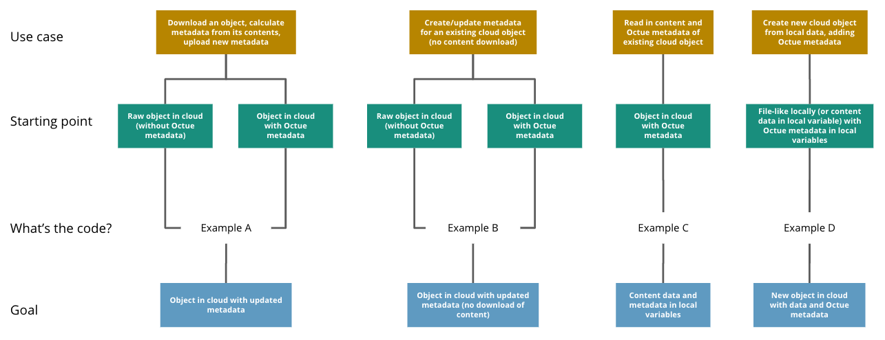

# Datafiles

!!! tip

    Use a datafile to work with a file if you want to:

    - Read/write to local and cloud files in the same way
    - Include it in a `dataset <dataset>`{.interpreted-text role="doc"} that
      can be sent to a Twined service for processing
    - Add metadata to it for future sorting and filtering

## Key features

### Work with local and cloud data

Working with a datafile is the same whether it's local or cloud-based.
It's also almost identical to using [python built-in open
function](https://docs.python.org/3/library/functions.html#open). For
example, to write to a datafile:

```python
from octue.resources import Datafile

datafile = Datafile("path/to/file.dat")

# Or:

datafile = Datafile("gs://my-bucket/path/to/file.dat")

with datafile.open("w") as f:
    f.write("Some data")
    datafile.labels.add("processed")
```

All the same file modes you'd use with the [python built-in open
context manager](https://docs.python.org/3/library/functions.html#open)
are available for datafiles e.g. `"r"` and `"a"`.

### Automatic lazy downloading

Save time and bandwidth by only downloading when necessary.

Downloading data from cloud datafiles is automatic and lazy so you get
both low-latency content read/write and quick metadata reads. This makes
viewing and filtering by the metadata of cloud datasets and datafiles
quick and avoids unnecessary data transfer, energy usage, and costs.

Datafile content isn't downloaded until you:

- Try to read or write its contents using the `Datafile.open` context manager
- Call its `download` method
- Use its `local_path` property

Read more about downloading files [here](downloading_datafiles.md).

### CLI command friendly

Use any command line tool on your datafiles. Datafiles are python
objects, but they represent real files that can be fed to any CLI
command you like

```python
import subprocess
output = subprocess.check_output(["openfast", datafile.local_path])
```

### Easy and expandable custom metadata

Find the needle in the haystack by making your data searchable. You can
set the following metadata on a datafile:

- Timestamp
- Labels (a set of lowercase strings)
- Tags (a dictionary of key-value pairs)

This metadata is stored locally in a `.octue` file for local datafiles
or on the cloud objects for cloud datafiles and is used during
`Datafile` instantiation. It can be accessed like this:

```python
datafile.timestamp
>>> datetime.datetime(2022, 5, 4, 17, 57, 57, 136739)

datafile.labels
>>> {"processed"}

datafile.tags
>>> {"organisation": "octue", "energy": "renewable"}
```

You can update the metadata by setting it on the instance while inside
the `Datafile.open` context manager.

```python
with datafile.open("a"):
    datafile.labels.add("updated")
```

You can do this outside the context manager too, but you then need to
call the update method:

```python
datafile.labels.add("updated")
datafile.update_metadata()
```

### Upload an existing local datafile

Back up and share your datafiles for collaboration. You can upload an
existing local datafile to the cloud without using the
`Datafile.open` context manager if you don't need to modify its contents:

```python
datafile.upload("gs://my-bucket/my_datafile.dat", update_metadata=True)
```

### Get file and metadata hashes

Make your analysis reproducible: guarantee a datafile contains exactly
the same data as before by checking its hash.

```python
datafile.hash_value
>>> 'mnG7TA=='
```

You can also check that any metadata is the same.

```python
datafile.metadata_hash_value
>>> 'DIgCHg=='
```

### Immutable ID

Each datafile has an immutable UUID:

```python
datafile.id
>>> '9a1f9b26-6a48-4f2d-be80-468d3270d79b'
```

### Check a datafile's locality

Is this datafile local or in the cloud?

```python
datafile.exists_locally
>>> True

datafile.exists_in_cloud
>>> False
```

A cloud datafile that has been downloaded will return `True` for both of
these properties.

### Represent HDF5 files

Support fast I/O processing and storage.

!!! warning

    If you want to represent HDF5 files with a `Datafile`, you must include
    the extra requirements provided by the `hdf5` key at installation i.e.

    ``` shell
    pip install octue[hdf5]
    ```

    or

    ``` shell
    poetry add octue -E hdf5
    ```

## Usage examples

The `Datafile` class can be used functionally or as a context manager.
When used as a context manager, it is analogous with the [python
built-in open
function](https://docs.python.org/3/library/functions.html#open). On
exiting the context (the `with` block), it closes the datafile locally
and, if the datafile also exists in the cloud, updates the cloud object
with any data or metadata changes.



### Example A

**Scenario:** Download a cloud object, calculate Octue metadata from its
contents, and add the new metadata to the cloud object

**Starting point:** Object in cloud with or without Octue metadata

**Goal:** Object in cloud with updated metadata

```python
from octue.resources import Datafile


datafile = Datafile("gs://my-bucket/path/to/data.csv")

with datafile.open() as f:
    data = f.read()
    new_metadata = metadata_calculating_function(data)

    datafile.timestamp = new_metadata["timestamp"]
    datafile.tags = new_metadata["tags"]
    datafile.labels = new_metadata["labels"]
```

### Example B

**Scenario:** Add or update Octue metadata on an existing cloud object
_without downloading its content_

**Starting point:** A cloud object with or without Octue metadata

**Goal:** Object in cloud with updated metadata

```python
from datetime import datetime
from octue.resources import Datafile


datafile = Datafile("gs://my-bucket/path/to/data.csv")

datafile.timestamp = datetime.now()
datafile.tags = {"manufacturer": "Vestas", "output": "1MW"}
datafile.labels = {"new"}

datafile.upload(update_metadata=True)  # Or, datafile.update_metadata()
```

### Example C

**Scenario:** Read in the data and Octue metadata of an existing cloud
object without intent to update it in the cloud

**Starting point:** A cloud object with Octue metadata

**Goal:** Cloud object data (contents) and metadata held locally in
local variables

```python
from octue.resources import Datafile


datafile = Datafile("gs://my-bucket/path/to/data.csv")

with datafile.open() as f:
    data = f.read()

metadata = datafile.metadata()
```

### Example D

**Scenario:** Create a new cloud object from local data, adding Octue
metadata

**Starting point:** A file-like locally (or content data in local
variable) with Octue metadata stored in local variables

**Goal:** A new object in the cloud with data and Octue metadata

For creating new data in a new local file:

```python
from octue.resources import Datafile


datafile = Datafile(
    "path/to/local/file.dat",
    tags={"cleaned": True, "type": "linear"},
    labels={"Vestas"}
)

with datafile.open("w") as f:
    f.write("This is some cleaned data.")

datafile.upload("gs://my-bucket/path/to/data.dat")
```

For existing data in an existing local file:

```python
from octue.resources import Datafile


tags = {"cleaned": True, "type": "linear"}
labels = {"Vestas"}

datafile = Datafile(path="path/to/local/file.dat", tags=tags, labels=labels)
datafile.upload("gs://my-bucket/path/to/data.dat")
```
