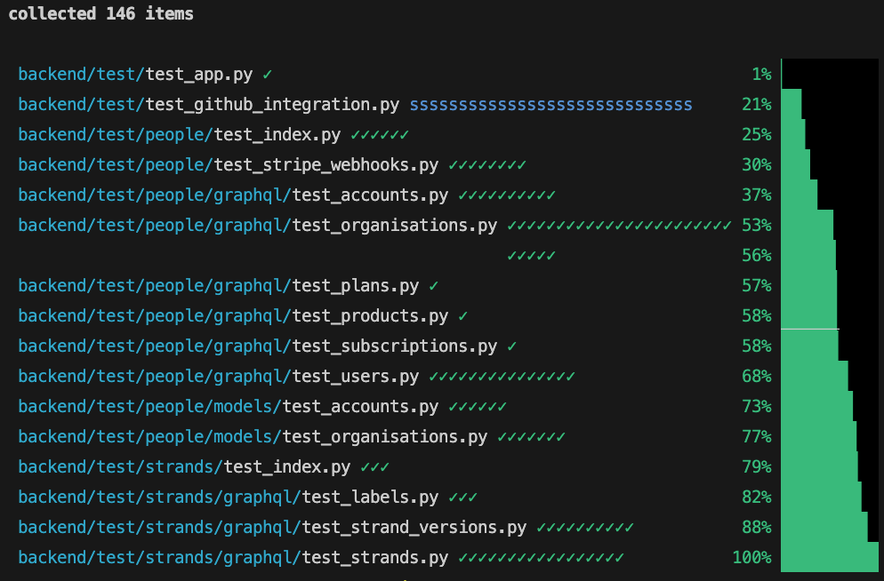
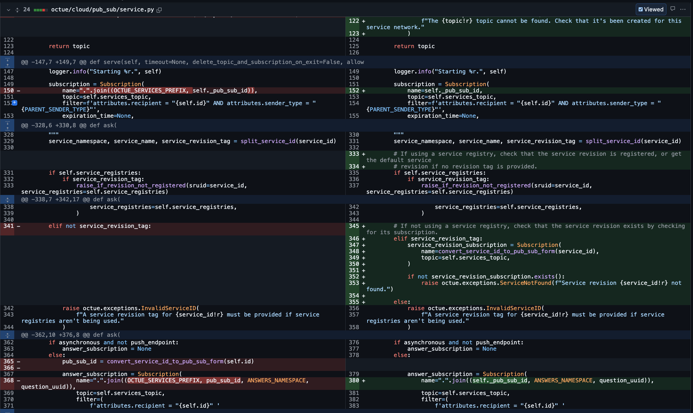
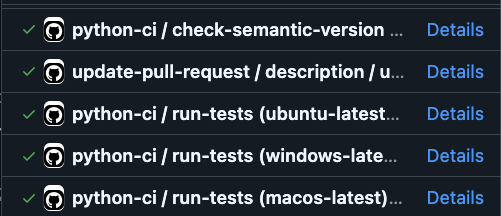
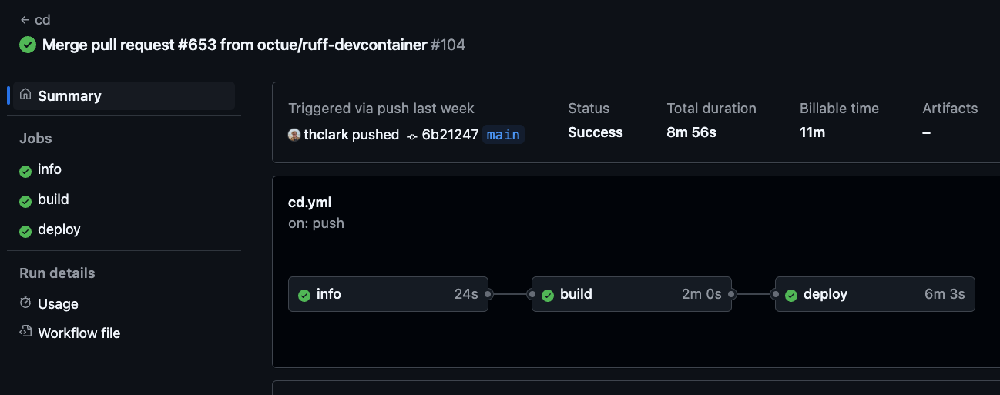

This page describes how to update an existing, deployed Twined service -
in other words, how to deploy a new Twined service revision.

We assume that:

- Your service's repository is on GitHub and you have push access to it
- The [standard Twined service deployment GitHub Actions
  workflow](https://github.com/octue/workflows/blob/main/.github/workflows/build-twined-service.yml)
  is set up in the repository and being used to build and push the
  service image to the artifact registry on merge of a pull request into
  the `main` branch (see an example
  [here](https://github.com/octue/example-service-kueue/blob/main/.github/workflows/release.yml))
- A release workflow is set up that will tag and release the new service
  revision on GitHub (see an example
  [here](https://github.com/octue/example-service-kueue/blob/main/.github/workflows/release.yml))

## Instructions

1.  Check out and pull the `main` branch to make sure you're up to date
    with the latest changes

    ```shell
    git checkout main
    git pull
    ```

2.  Install your service locally so you can run the tests and your
    development environment can lint the code etc.:

    ```shell
    poetry install
    ```

3.  Set up [pre-commit](https://pre-commit.com/) to enforce code
    quality:

    ```shell
    pre-commit install && pre-commit install -t commit-msg
    ```

4.  Check out a new branch so you can work independently of any other
    work on the code happening at the same time

    ```shell
    git checkout -b my-new-feature
    ```

5.  Add and make changes to your app's code as needed, committing each
    self-contained change. Use the [Conventional
    Commits](https://www.conventionalcommits.org/en/v1.0.0/) commit
    message format so the new version for your service can be
    automatically calculated.

    ```shell
    git add a-new-file another-new-file
    git commit -m "Your commit message"
    ...repeat...
    ```

    Push your commits frequently so your work is backed up on GitHub

    ```shell
    git push
    ```

6.  Write any new tests you need to verify your code works and update
    any old tests as needed

7.  Run the tests locally using `pytest` and fix anything that makes
    them fail

    

8.  Update the [semantic version](https://semver.org/) of your app. This
    communicates to anyone updating from a previous version of the
    service whether they can use it as before or if there might be
    changes they need to make to their own code or data first.

    - `poetry version patch` for a bug fix or small non-code change
    - `poetry version minor` for a new feature
    - `poetry version major` for a breaking change

    Don't forget to commit this change, too.

9.  When you're ready to review the changes, head to GitHub and open a
    pull request of your branch into `main`. This makes it easy for you
    and anyone else to see what's changed. Check the "Files Changed"
    tab to make sure everything's there and consistent (it's easy to
    forget to push a commit). Ask your colleagues to review the code if
    required.

    

10. When you're ready to release the new version of your service, check
    that the GitHub checks have passed. These ensure code quality, that
    the tests pass, and that the new version number is correct.

    

11. Merge the pull request into `main`. This will run the deployment
    workflow (usually called `cd` - continuous deployment), making the
    new version of the service available to everyone.
12. Check that the deployment workflow has run successfully (this can
    take a few minutes). You can check the progress in the "Actions"
    tab of the GitHub repository

    
