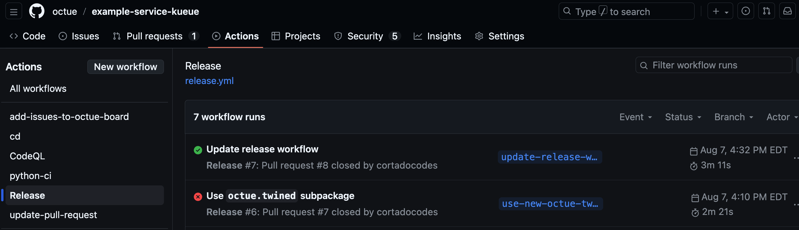

# Getting started - creating services

Turn your analysis code into production-ready services - no infrastructure or DevOps skills needed - and share with
your team and beyond.

This guide walks you through creating an example Twined service deployed in the cloud. By the end, you'll have a real
service and be able to ask it questions from your computer and receive answers from it over the internet.

!!! tip

    You can see our deployed example service [here on GitHub](https://github.com/octue/example-service-kueue).

## Prerequisites

Before you begin, ensure you:

<!-- prettier-ignore-start -->

- Are familiar with Python and the command line
- Have the following tools installed:
    - Python >= 3.10
    - The `octue` python library / CLI (see [installation instructions](../installation.md))
- Have access to an existing Twined service network - see [authentication instructions](../authentication.md)
  and [managing infrastructure](../getting_started/managing_infrastructure.md)

<!-- prettier-ignore-end -->

## Create and clone a GitHub repository

!!! warning

    The repository must be created in the same GitHub account used for your Twined service network. See
    [this issue](https://github.com/octue/octue-sdk-python/issues/740) for more details.

Create a git repository for the service in the GitHub account linked to the Twined service network. Clone this
repository to your computer and checkout a new branch called `add-new-service`. Replace `<handle>` with the handle of
the GitHub account.

```shell
git clone https://github.com/<handle>/example-service.git
cd example-service
git checkout -b add-new-service
```

## Install the python dependencies

Create a `pyproject.toml` file to define the service as a python package and list its dependencies:

```toml
[tool.poetry]
name = "example-service"
version = "0.1.0"
description = "An example Twined data service."
authors = ["Your name <your email>"]
packages = [{include = "example_service"}]

[tool.poetry.dependencies]
python = "^3.11"
octue = "0.69.0"

[build-system]
requires = ["poetry-core"]
build-backend = "poetry.core.masonry.api"
```

!!! tip

    We use Poetry in this example but you can use Pip or another package manager with either a `setup.py` or
    `pyproject.toml` file.

Now install the dependencies:

```shell
poetry install
```

Note that this will create a `poetry.lock` file with the locked dependency versions in. Keep this file.

## Write the service python code

We'll make the example service calculate the first `n` numbers in the Fibonacci sequence.

Create a directory called `example_service` with an empty `__init__.py` file and an `app.py` file inside. In `app.py`,
add the following code:

```python
import json
import logging
import time

from octue.resources import Datafile, Dataset
from octue.twined.resources.example import calculate_fibonacci_sequence

logger = logging.getLogger(__name__)


def run(analysis):
    logger.info("Started example analysis.")

    # Get your input values...
    n = analysis.input_values["n"]

    # Do your calculations here...
    sequence = calculate_fibonacci_sequence(n)
    time.sleep(2)

    # Return results by assigning output values...
    analysis.output_values = {"fibonacci": sequence}

    # If output values are too large, or custom/binary file outputs
    # are required, you can save them as Datafiles and add them to
    # the output manifest...
    with Datafile("fibonacci.json", mode="w") as (datafile, f):
        json.dump(analysis.output_values, f)

    analysis.output_manifest.datasets["example_dataset"] = Dataset(files={datafile})
    logger.info("Finished example analysis.")
```

## Add the Twine file

The Twine file is a JSON file containing [JSON schemas](https://json-schema.org/) stating what kind of data is expected
as inputs and outputs of the service. It shows users what can be sent to the service and what to expect to receive.
Inputs and outputs that violate the schemas won't be processed and will cause an error.

Create a file at the top level of the repository called `twine.json`:

```json
{
  "input_values_schema": {
    "type": "object",
    "required": ["n"],
    "properties": {
      "n": {
        "type": "integer",
        "minimum": 0
      }
    }
  },
  "output_values_schema": {
    "type": "object",
    "required": ["fibonacci"],
    "properties": {
      "fibonacci": {
        "type": "array",
        "items": {
          "type": "integer"
        }
      }
    }
  },
  "output_manifest": {
    "datasets": {
      "example_dataset": {}
    }
  }
}
```

!!! tip

    Learn more about `twine.json` files [here](../core_concepts/creating_services.md/#twinejson).

## Add the `octue.yaml` file

The service configuration file (called `octue.yaml`) names the service and sets details like where to store output data.
Create an `octue.yaml` file at the top level of the repository, replacing:

- `<handle>` with the GitHub account handle
- `<gcp-project-id>` with the ID of the Google Cloud Platform (GCP) project the Twined service network is deployed in
- `<region>` with the name of the GCP region the service network is deployed in (e.g. `europe-west1`)
- `<environment>` with the name of the environment the service network is deployed in (`main` by default)

!!! tip

    Ask the manager of your Twined service network to help you with these values!

```yaml
services:
  - namespace: <handle>
    name: example-service
    app_source_path: example_service
    event_store_table_id: octue_twined.service-events
    diagnostics_cloud_path: gs://<gcp-project-id>-octue-twined/example-service/diagnostics
    output_location: gs://<gcp-project-id>-octue-twined/example-service/outputs
    service_registries:
      - name: <handle>'s services
        endpoint: https://<region>-<gcp-project-id>.cloudfunctions.net/<environment>-octue-twined-service-registry
```

!!! tip

    Learn more about `octue.yaml` files [here](../core_concepts/creating_services.md/#octueyaml).

## Enable GitHub Actions in the repository

Go back to your repository on GitHub and open [its Actions settings](https://docs.github.com/en/repositories/managing-your-repositorys-settings-and-features/enabling-features-for-your-repository/managing-github-actions-settings-for-a-repository#managing-github-actions-permissions-for-your-repository)
(Settings -> Actions -> General). Set the "Actions permissions" option to "Allow all actions and reusable workflows".

## Add the GitHub Actions deploy workflow

A GitHub Actions reusable workflow is used to automatically deploy the service when its code is merged into `main`.
Create a file called `.github/workflows/deploy.yml` and add the following, replacing `<handle>` and
`<gcp-project-id>` as before:

```yaml
name: deploy

# Only trigger when a pull request into main branch is merged.
on:
  push:
    branches:
      - main

jobs:
  deploy:
    uses: octue/workflows/.github/workflows/build-twined-service.yml@0.11.0
    permissions:
      id-token: write
      contents: read
    with:
      gcp_project_name: <gcp-project-id>
      gcp_project_number: <gcp-project-number>
      gcp_region: <gcp-project-region>
      service_namespace: <handle>
      service_name: example-service
```

!!! tip

    See [here](https://github.com/octue/workflows?tab=readme-ov-file#deploying-a-kuberneteskueue-octue-twined-service-revision)
    for more information, including how to use custom dockerfiles for your service.

## Check your files

Once you've finished the steps above, your repository should have a file structure like this:

```
.
├── .github
│   └── workflows
│       └── deploy.yml
├── example_service
│   ├── __init__.py
│   └── app.py
├── octue.yaml
├── poetry.lock
├── pyproject.toml
└── twine.json
```

## Merge the code into `main`

To deploy the service, we need to merge the code we've added into the `main` branch. Make sure any sensitive and
irrelevant files are listed in a `.gitignore` file and run:

```shell
git add .
git commit -m "Add example Twined service"
git push
```

For best practice, open a pull request for your branch into `main`, review it, and merge it. For a simpler route:

```shell
git checkout main
git merge add-new-service
git push
```

Navigate to your repository's "Actions" tab on GitHub and you should see the deploy workflow progressing after a few
seconds. An in-progress indicator (currently a small orange circle) will be shown against the most recent commit. Once
the workflow has completed (which should take only a couple of minutes for this simple example service), a green tick
should show next to the most recent commit.

<br/>
<figure markdown="span">
  
  <figcaption>The "Actions" tab of the GitHub repository. A successful workflow run is shown at the top with a green
   tick while a failed one is shown below it with a red cross. Note that the workflow in the image is called
   "release.yaml" but yours is called "deploy.yaml".
  </figcaption>
</figure>

## Ask the service its first question

You can now communicate with the service over the internet to ask
it a question! Follow the [authentication instructions](../authentication.md) in the terminal where you ran `poetry install`, replace
`<handle>` as before, and run:

```shell
octue twined question ask <handle>/example-service:0.1.0 --input-values='{"n": 10}'
```

After a couple of minutes (while the Kubernetes cluster is spinning up a container to run the service), you should see
log messages start to appear. Finally, the first 10 values in the Fibonacci sequence are returned as output values:

```
[2025-11-05 12:45:29,861 | INFO | octue.twined.resources.example] Starting Fibonacci sequence calculation.
[2025-11-05 12:45:29,861 | INFO | octue.twined.resources.example] Finished Fibonacci sequence calculation.
{"kind": "result", "output_values": {"fibonacci": [0, 1, 1, 2, 3, 5, 8, 13, 21, 34]}, "output_manifest": null}
```

!!! tip

    See the [using services getting started guide](using_services.md) to see how to ask questions in python instead.

## Next steps

!!! success

    Congratulations on creating your first service! For additional information, check out the following resources:

    - [Read about the core concepts of Twined](../core_concepts/creating_services.md)
    - [Create infrastructure for a Twined service network](managing_infrastructure.md)

## Troubleshooting

!!! failure

    If you get this error, double check you've followed the [authentication instructions](../authentication.md) fully.

    ```
    octue.exceptions.CloudLocationNotSpecified: `project_id` must be specified for a service to connect to the correct service - received None.
    ```

!!! failure

    If your question gets stuck with a log message saying `Waiting for question to be accepted...`, take a look at the
    [troubleshooting infrastructure guide](../core_concepts/troubleshooting_infrastructure.md).
