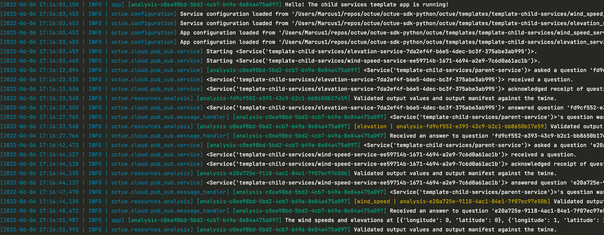

# Logging

By default, `octue` streams your logs to `stderr` in a nice, readable
format so your log messages are immediately visible when you start
developing without any extra configuration. If you prefer to use your
own handlers or formatters, simply set `USE_OCTUE_LOG_HANDLER=0` in the
environment running your app.

## Readable logs

Some advantages of the Octue log handler are:

- Its readable format
- Its clear separation of log **context** from log **message**.

Below, the context is on the left and includes:

- The time
- Log level
- Module producing the log
- Octue analysis ID

This is followed by the actual log message on the right:

```
[2021-07-10 20:03:12,713 | INFO | octue.runner | 102ee7d5-4b94-4f8a-9dcd-36dbd00662ec] Hello! The child services template app is running!
```

## Colourised services

Another advantage to using the Octue log handler is that each Twined
service is coloured according to its position in the tree, making it
much easier to read log messages from multiple levels of children.



In this example:

- The log context is in blue
- Anything running in the root parent service's app is labeled with the
  analysis ID in green
- Anything running in the immediate child services (`elevation` and
  `wind_speed`) are labelled with the analysis ID in yellow
- Any children further down the tree (i.e. children of the child
  services and so on) will have their own labels in other colours
  consistent to their level

## Add extra information

You can add certain log record attributes to the logging context by also
providing the following environment variables:

- `INCLUDE_LINE_NUMBER_IN_LOGS=1` - include the line number
- `INCLUDE_PROCESS_NAME_IN_LOGS=1` - include the process name
- `INCLUDE_THREAD_NAME_IN_LOGS=1` - include the thread name
