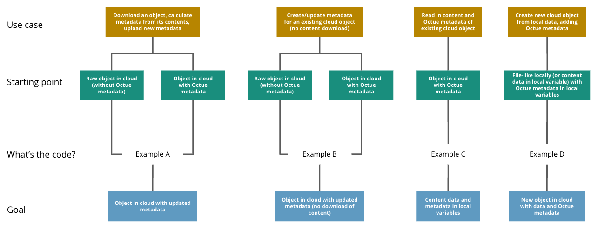

.. _datafile:

========
Datafile
========
A single local or cloud file and its metadata.

Key features
============

Work with local and cloud data
------------------------------

Working with a datafile is almost identical to using the built-in ``open`` function, and the same whether it’s local or in the cloud.

For example, this is how to write to a local datafile:

.. code-block:: python

    from octue.resources import Datafile

    datafile = Datafile("path/to/file.dat")

    with datafile.open("w") as f:
        f.write("Some data")
        datafile.labels.add("processed")

And this is how to write to a cloud datafile:

.. code-block:: python

    datafile = Datafile("gs://my-bucket/path/to/file.dat")

    with datafile.open("w") as f:
        f.write("Some data")
        datafile.labels.add("processed")

All the same file modes you'd use with the built-in ``open`` are available for datafiles e.g. ``"r"`` and ``"a"``.

Automatic lazy downloading
--------------------------
Downloading data from cloud datafiles is automatic and lazy so you get both low-latency content read/write and quick
metadata reads. This makes viewing and filtering by the metadata of cloud datasets and datafiles quick and avoids
unnecessary data transfer, energy usage, and costs.

Datafile content isn't downloaded until you:

- Try to read or write its contents using the ``Datafile.open`` context manager
- Call its ``download`` method
- Use its ``local_path`` property

CLI command friendly
--------------------
Datafiles are python objects, but they represent real files that can be fed to any CLI command you like

.. code-block:: python

    import subprocess
    output = subprocess.check_output(["openfast", datafile.local_path])

Easy and expandable custom metadata
-----------------------------------

You can set the following metadata on a datafile:

- ID
- Timestamp
- Labels (a set of lowercase strings)
- Tags (a dictionary of key-value pairs)

This metadata is stored locally in a ``.octue`` file for local datafiles or on the cloud objects for cloud datafiles and
is used during ``Datafile`` instantiation. It can be accessed like this:

.. code-block:: python

    datafile.id
    >>> '9a1f9b26-6a48-4f2d-be80-468d3270d79b'

    datafile.timestamp
    >>> datetime.datetime(2022, 5, 4, 17, 57, 57, 136739)

    datafile.labels
    >>> {"processed"}

    datafile.tags
    >>> {"organisation": "octue", "energy": "renewable"}

You can update the metadata by setting it on the instance while inside the ``Datafile.open`` context manager.

.. code-block:: python

    with datafile.open("a"):
        datafile.labels.add("updated")

You can do this outside the context manager too, but you then need to call the update method:

.. code-block:: python

    datafile.labels.add("updated")
    datafile.update_metadata()

Upload an existing local datafile
---------------------------------
You can upload an existing local datafile to the cloud without using the ``open`` context manager if you don't need to modify its contents:

.. code-block:: python

    datafile.upload("gs://my-bucket/my_datafile.dat", update_metadata=True)

Get file hashes
---------------
File hashes guarantee you have the right file. Getting the hash of datafiles is simple:

.. code-block:: python

    datafile.hash_value
    >>> 'mnG7TA=='

Check a datafile's locality
---------------------------

.. code-block:: python

    datafile.exists_locally
    >>> True

    datafile.exists_in_cloud
    >>> False

A cloud datafile that has been downloaded will return ``True`` for both of these properties.

Represent HDF5 files
--------------------

.. warning::
    If you want to represent HDF5 files with a ``Datafile``, you must include the extra requirements provided by the
    ``hdf5`` key at installation i.e.

    .. code-block:: shell

        pip install octue[hdf5]

    or

    .. code-block:: shell

        poetry add octue -E hdf5

More information on downloading
-------------------------------
To avoid unnecessary data transfer and costs, datafiles that only exist in the cloud are not downloaded locally until
the ``download`` method is called on them or their ``local_path`` property is used for the first time. When either of
these happen, the cloud object is downloaded to a temporary local file. Any changes made to the local file via the
``Datafile.open`` method (which can be used analogously to the python built-in ``open`` function) are synced up with
the cloud object. The temporary file will exist as long as the python session is running. Calling ``download`` again
will not re-download the file as it will be up to date with any changes made locally. However, external changes to the
cloud object will not be synced locally unless the ``local_path`` is set to ``None``, followed by running the ``download``
method again.

If you want a cloud object to be permanently downloaded, you can either:

- Set the ``local_path`` property of the datafile to the path you want the object to be downloaded to

  .. code-block:: python

      datafile.local_path = "my/local/path.csv"

- Use the ``download`` method with the ``local_path`` parameter set

  .. code-block:: python

      datafile.download(local_path="my/local/path.csv")

Either way, the datafile will now exist locally as well in the cloud.

Usage examples
==============

The ``Datafile`` class can be used functionally or as a context manager. When used as a context manager, it is analogous
to the builtin ``open`` function context manager. On exiting the context (the ``with`` block), it closes the datafile
locally and, if the datafile also exists in the cloud, updates the cloud object with any data or metadata changes.

Example A
---------
**Scenario:** Download a cloud object, calculate Octue metadata from its contents, and add the new metadata to the cloud object

**Starting point:** Object in cloud with or without Octue metadata

**Goal:** Object in cloud with updated metadata

.. code-block:: python

    from octue.resources import Datafile

    path = "gs://my-bucket/path/to/data.csv"

    with Datafile(path, mode="r") as (datafile, f):
        data = f.read()
        new_metadata = metadata_calculating_function(data)

        datafile.timestamp = new_metadata["timestamp"]
        datafile.tags = new_metadata["tags"]
        datafile.labels = new_metadata["labels"]

Example B
---------
**Scenario:** Add or update Octue metadata on an existing cloud object *without downloading its content*

**Starting point:** A cloud object with or without Octue metadata

**Goal:** Object in cloud with updated metadata

.. code-block:: python

    from datetime import datetime
    from octue.resources import Datafile

    datafile = Datafile("gs://my-bucket/path/to/data.csv")

    datafile.timestamp = datetime.now()
    datafile.tags = {"manufacturer": "Vestas", "output": "1MW"}
    datafile.labels = {"new"}

    datafile.upload(update_metadata=True)  # Or, datafile.update_metadata()

Example C
---------
**Scenario:** Read in the data and Octue metadata of an existing cloud object without intent to update it in the cloud

**Starting point:** A cloud object with Octue metadata

**Goal:** Cloud object data (contents) and metadata held locally in local variables

.. code-block:: python

    from octue.resources import Datafile

    datafile = Datafile("gs://my-bucket/path/to/data.csv")

    with datafile.open("r") as f:
        data = f.read()

    metadata = datafile.metadata()

Example D
---------
**Scenario:** Create a new cloud object from local data, adding Octue metadata

**Starting point:** A file-like locally (or content data in local variable) with Octue metadata stored in local variables

**Goal:** A new object in the cloud with data and Octue metadata

For creating new data in a new local file:

.. code-block:: python

    from octue.resources import Datafile

    tags = {"cleaned": True, "type": "linear"}
    labels = {"Vestas"}

    with Datafile(path="path/to/local/file.dat", tags=tags, labels=labels, mode="w") as (datafile, f):
        f.write("This is some cleaned data.")

    datafile.upload("gs://my-bucket/path/to/data.dat")

For existing data in an existing local file:

.. code-block:: python

    from octue.resources import Datafile

    tags = {"cleaned": True, "type": "linear"}
    labels = {"Vestas"}

    datafile = Datafile(path="path/to/local/file.dat", tags=tags, labels=labels)
    datafile.upload("gs://my-bucket/path/to/data.dat")
