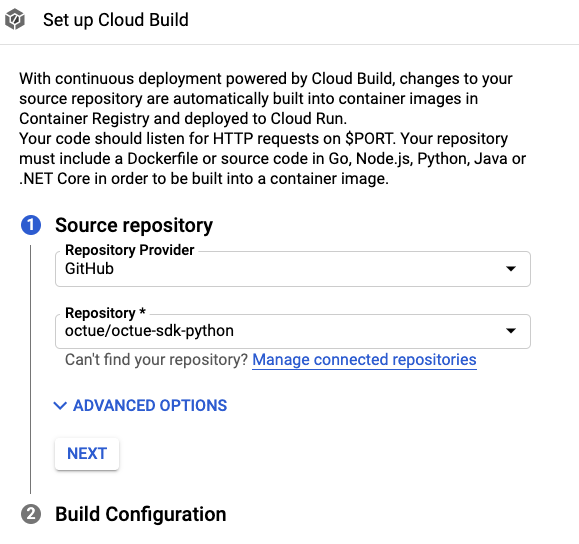
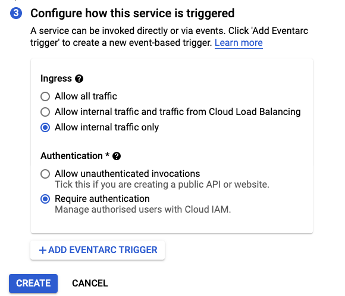
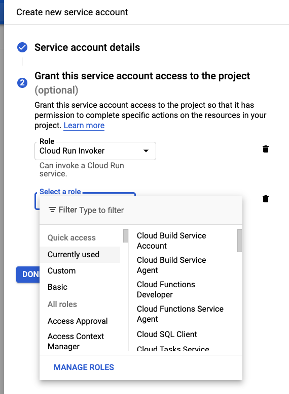

.. _deploying_services_advanced:

======================================
Deploying services (developer's guide)
======================================
This is a guide for developers that want to deploy Octue services themselves - it is not needed if Octue manages your
services for you or if you are only asking questions to existing Octue services.

What deployment enables
-----------------------
Deploying an Octue service to Google Cloud Run means it:

* Is deployed as a docker container
* Is ready to be asked questions by any other Octue service that has the correct permissions (you can control this)
* Can ask questions to any other Octue service for which it has the correct permissions
* Will automatically build and redeploy upon the conditions you provide (e.g. pushes or merges into ``main``)
* Will automatically start and run when Pub/Sub messages are received from the topic you created. The Pub/Sub
  messages can be sent from anywhere in the world, but the container will only run in the region you chose (you can
  create multiple Cloud Run services in different regions for the same repository if this is a problem).
* Will automatically stop shortly after finishing the analyses asked for in the Pub/Sub message (although
  you can set a minimum container count so one is always running to minimise cold starts).

How to deploy
-------------
1. Ensuring you are in the desired project, go to the `Google Cloud Run <https://console.cloud.google.com/run>`_ page
   and create a new service

.. image:: images/deploying_services_advanced/create_service.png

2. Give your service a unique name

.. image:: images/deploying_services_advanced/service_name_and_region.png

3. Choose a `low-carbon region <https://cloud.google.com/sustainability/region-carbon#data>`_ that supports Eventarc
   triggers and is in a convenient geographic location for you (e.g. physically close to you for low latency or in a
   region compatible with your data protection requirements).

.. image:: images/deploying_services_advanced/low_carbon_regions.png

3. Click "Next". When changes are made to the source code, we want them to be deployed automatically. So, we need to
   connect the repository to GCP to enable this. Select "Continuously deploy new revisions from a source repository" and
   then "Set up with cloud build".

.. image:: images/deploying_services_advanced/set_up_with_cloud_build.png

4. Choose your source code repository provider and the repository containing the code you'd like to deploy. You'll have
   to give the provider permission to access the repository. If your provider isn't GitHub, BitBucket, or Google Cloud
   Source Repositories (GCSR), you'll need to mirror the repository to GCSR before completing this step as Google Cloud
   Build only supports these three providers currently.

5. Click "Next", enter a regular expression for the branches you want to automatically deploy from (``main`` by default).
   As the service will run in a docker container, select "Dockerfile" and click "Save".

.. image:: images/deploying_services_advanced/choose_dockerfile.png

6. Click "Next". If you want your service to be private, select "Allow internal traffic only" and "Require
   authentication". This stops anyone without permission from using the service.

7. The service needs a trigger to start up and respond to. We'll be using Google Pub/Sub. Click "Add eventarc trigger",
   choose "Cloud Pub/Sub topic" as the trigger event, click on the menu called "Select a Cloud Pub/Sub topic", then
   click "Create a topic". Any services that want to ask your service a question will publish their question to this
   topic.

.. image:: images/deploying_services_advanced/create_trigger.png

8. The topic ID should be in the form ``octue.services.my-organisation.my-service``. Click "Create topic".

9. Under "Invocation settings", click on the "Service account" menu and then "Create new service account".

.. image:: images/deploying_services_advanced/create_service_account.png

10. Make a new service account with a related name e.g. "my-service", then click "Create". Add the
    "octue-service-user" and "Cloud Run Invoker" roles to the service account. Contact us if the "octue-service-user"
    role is not available.

11. Click "Save" and then "Create".

.. image:: images/deploying_services_advanced/save_and_create.png

12. You can now view your service in the list of `Cloud Run services <https://console.cloud.google.com/run>`_ and view
    its build trigger in the list of `Cloud Build triggers <https://console.cloud.google.com/cloud-build>`_.
