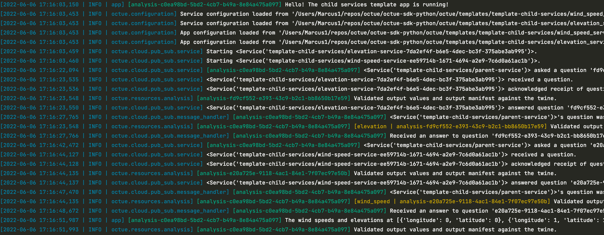

=======
Logging
=======
By default, ``octue`` leaves handling of log messages raised by your app to you. However, if you just want a simple,
readable logging arrangement, you can let ``octue`` format and stream your logs to ``stderr``. If this is for you,
simply set ``USE_OCTUE_LOG_HANDLER=1`` in the environment running your app. This will attach the Octue log handler to
the root python logger.

Readable logs
-------------
Some advantages of the Octue log handler are:

- Its readable format
- Its clear separation of log **context** from log **message**.

Below, the context is on the left and includes:

- The time
- Log level
- Module producing the log
- Octue analysis ID

This is followed by the actual log message on the right:

.. code-block::

    [2021-07-10 20:03:12,713 | INFO | octue.runner | analysis-102ee7d5-4b94-4f8a-9dcd-36dbd00662ec] Hello! The child services template app is running!

Colourised services
-------------------
Another advantage to using the Octue log handler is that each Octue service is coloured according to its position in the
tree, making it much easier to read log messages from multiple levels of children.

In this example:

- The log context is in blue
- Anything running in the root parent service's app is labeled with the analysis ID in green
- Anything running in the immediate child services (``elevation`` and ``wind_speed``) are labelled with the analysis ID
  in yellow
- Any children further down the tree (i.e. children of the child services and so on) will have their own labels in
  other colours consistent to their level

Add extra information
---------------------
You can add certain log record attributes to the logging context by also providing the following environment variables:

- ``INCLUDE_LINE_NUMBER_IN_LOGS=1`` - include the line number
- ``INCLUDE_PROCESS_NAME_IN_LOGS=1`` - include the process name
- ``INCLUDE_THREAD_NAME_IN_LOGS=1`` - include the thread name
